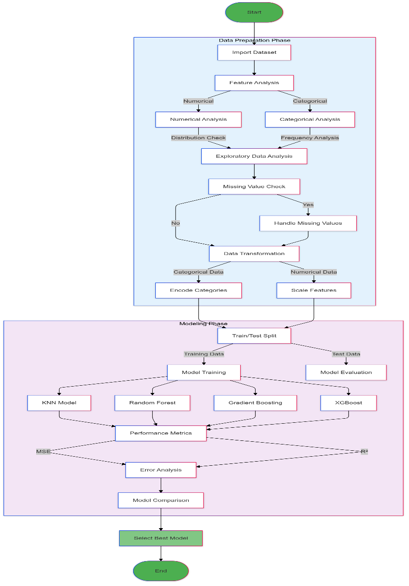
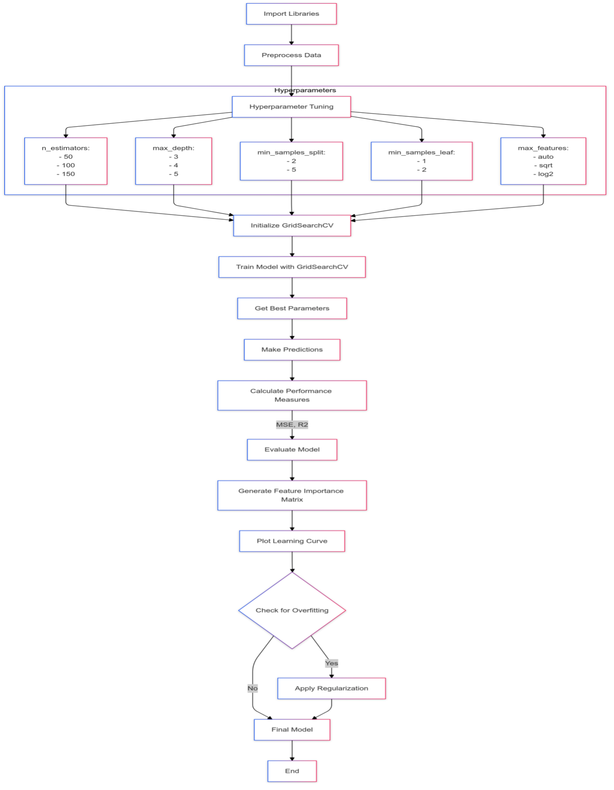
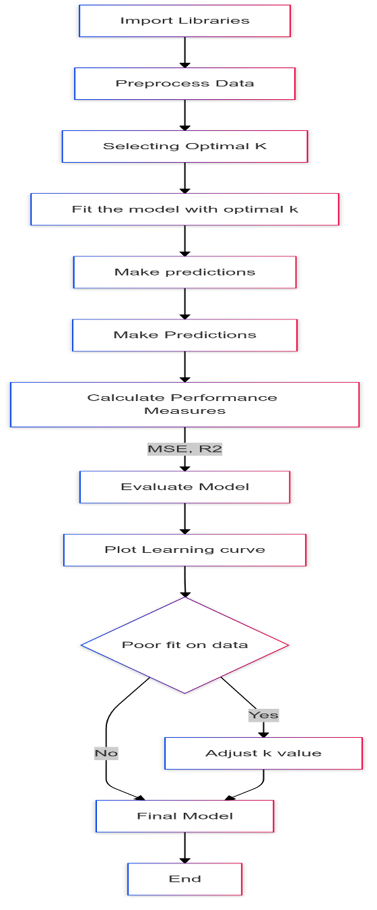

# Machine-Learning-Modeling
## Predictive Modeling of Treatment Charges Before Hospital Admission.
### Author: Isuru De Zoysa

In the current medical setup, managing healthcare costs is challenging for patients, healthcare providers, and insurance companies worldwide [1]. Effectively predicting inpatient hospital charges has a greater influence on financial planning, healthcare management, and resource allocation. However, inpatient medical payment data is confidential; hence, researchers have valued Payment-to-Charge Ratios (PCRs) for hospitals as estimated payments [3]. The foremost objective of this study is to predict inpatient hospital charges using machine learning approaches. This method benefits patients, insurance companies, and medical facility providers for better customer service [1], [6]. 

In personal financial management, these machine-learning models influence patients’ decision-making process before hospital admission by accurately predicting their expenditure on healthcare services [7], [12]. Also, healthcare providers can accurately plan customer services by predicting hospital charges by incorporating the most influential factors that increase healthcare costs [13].

**Current Challenges**

Several factors contribute to the complexity of hospital expenditure prediction:

**Variable Length of Stay:** Patient hospital stays can vary significantly, affecting total costs in unpredictable ways [19]. Research indicates that length of stay alone can account for up to 40% of cost variation in certain medical conditions.

**Treatment Complexity:** Modern medical care often involves multiple procedures, specialists, and treatment modalities, each adding layers of cost variability [4].

**Patient Heterogeneity:** Individual patient characteristics, including demographics, comorbidities, and social determinants of health, significantly impact treatment costs [4]. Recent studies have shown that demographic factors can influence hospital costs by up to 25%.

**Healthcare Environment:** Rapidly evolving medical technologies, treatment protocols, and pricing structures create a constantly changing cost [12].

**Treatment Complexity:** Modern medical care often involves multiple procedures, specialists, and treatment modalities, each adding layers of cost variability [7].

**STUDY GAP**

While traditional cost prediction methods have relied on simple regression models and basic statistical approaches, these methods often fail to capture the complex, non-linear relationships between patient characteristics, treatment patterns, and ultimate costs, a clear need for more sophisticated prediction models that can:

• Handle large volumes of heterogeneous healthcare data.

• Account for complex interactions between variables.

• Adapt to changing healthcare environments.

• Provide accurate predictions across diverse patient populations.

**OBJECTIVES**

This study aims to develop and validate a machine learning-based approach for predicting inpatient hospital costs with the following specific objectives:

1. *Model Development*: Create a robust machine learning model that incorporates diverse data sources, including:
   
• Patient demographic information.

• Clinical diagnoses and procedures.

• Length of stay estimates.

2. *Prediction Accuracy*: Achieve superior prediction accuracy compared to traditional statistical methods by leveraging advanced machine learning algorithms and feature engineering techniques.

**EXPECTED IMPACT**

Accurate hospital cost prediction models have the potential to improve healthcare delivery systems significantly [19]. Research indicates potential benefits including:

• Improve hospital resource allocation and budgeting.

• Enhance insurance pricing and risk assessment.

• Support better financial planning for healthcare providers.

• Enable more transparent cost communication with patients.

• Facilitate more efficient healthcare delivery systems.

**METHODOLOGY**

The data set used for this study is data from Mission Hospital patients in India. There were 248 data points with 24 features categorizing medical data, personal data, stay-at-hospital data and symptoms data.

| Type of Data  | Features            |
|-------|--------------------------|
| Medical data | Key complaint codes, Past medical history code, Implant (Y/N)|
| Personal data| Age, Gender, BMI, Marital Status, Weight, Height, Marital Status|
| Stay at hospital data| Total Length of Stay, Length of stay-ICU, Length of stay- Ward, Mode of arrival, State at arrival, Type of admission, **Total cost**, Cost of implant|
| Symptoms (Diagnostic) data| HR Pulse, BP-High, BP-Low, RR, HB, Urea, Creatinine |

<b>Table 1: Selected Variables.</b>

*Figure 1: Methodology Flowchart.*

**MODEL EXPERIMENTS**

*RANDOM FOREST*

*Figure 2: Methodology of Random Forest.*

*KNN*

*Figure 3: Methodology of Random Forest.*

