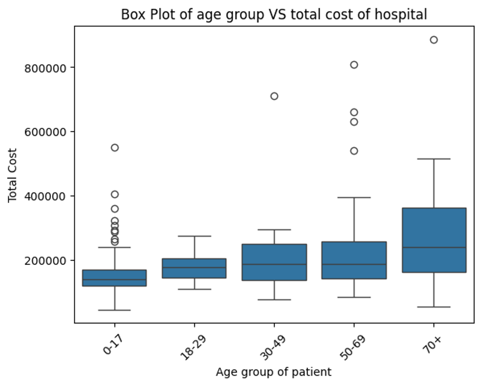

# Machine-Learning-Modeling
## Predictive Modeling of Treatment Charges Before Hospital Admission.
### Author: Isuru De Zoysa

In the current medical setup, managing healthcare costs is challenging for patients, healthcare providers, and insurance companies worldwide [1]. Effectively predicting inpatient hospital charges has a greater influence on financial planning, healthcare management, and resource allocation. However, inpatient medical payment data is confidential; hence, researchers have valued Payment-to-Charge Ratios (PCRs) for hospitals as estimated payments [3]. The foremost objective of this study is to predict inpatient hospital charges using machine learning approaches. This method benefits patients, insurance companies, and medical facility providers for better customer service [1], [6]. 

In personal financial management, these machine-learning models influence patients’ decision-making process before hospital admission by accurately predicting their expenditure on healthcare services [7], [12]. Also, healthcare providers can accurately plan customer services by predicting hospital charges by incorporating the most influential factors that increase healthcare costs [13].

**Current Challenges**

Several factors contribute to the complexity of hospital expenditure prediction:

**Variable Length of Stay:** Patient hospital stays can vary significantly, affecting total costs in unpredictable ways [19]. Research indicates that length of stay alone can account for up to 40% of cost variation in certain medical conditions.

**Treatment Complexity:** Modern medical care often involves multiple procedures, specialists, and treatment modalities, each adding layers of cost variability [4].

**Patient Heterogeneity:** Individual patient characteristics, including demographics, comorbidities, and social determinants of health, significantly impact treatment costs [4]. Recent studies have shown that demographic factors can influence hospital costs by up to 25%.

**Healthcare Environment:** Rapidly evolving medical technologies, treatment protocols, and pricing structures create a constantly changing cost [12].

**Treatment Complexity:** Modern medical care often involves multiple procedures, specialists, and treatment modalities, each adding layers of cost variability [7].

**STUDY GAP**

While traditional cost prediction methods have relied on simple regression models and basic statistical approaches, these methods often fail to capture the complex, non-linear relationships between patient characteristics, treatment patterns, and ultimate costs, a clear need for more sophisticated prediction models that can:

• Handle large volumes of heterogeneous healthcare data.

• Account for complex interactions between variables.

• Adapt to changing healthcare environments.

• Provide accurate predictions across diverse patient populations.

**OBJECTIVES**

This study aims to develop and validate a machine learning-based approach for predicting inpatient hospital costs with the following specific objectives:

1. *Model Development*: Create a robust machine learning model that incorporates diverse data sources, including:
   
• Patient demographic information.

• Clinical diagnoses and procedures.

• Length of stay estimates.

2. *Prediction Accuracy*: Achieve superior prediction accuracy compared to traditional statistical methods by leveraging advanced machine learning algorithms and feature engineering techniques.

**EXPECTED IMPACT**

Accurate hospital cost prediction models have the potential to improve healthcare delivery systems significantly [19]. Research indicates potential benefits including:

• Improve hospital resource allocation and budgeting.

• Enhance insurance pricing and risk assessment.

• Support better financial planning for healthcare providers.

• Enable more transparent cost communication with patients.

• Facilitate more efficient healthcare delivery systems.

**METHODOLOGY**

The data set used for this study is data from Mission Hospital patients in India. There were 248 data points with 24 features categorizing medical data, personal data, stay-at-hospital data and symptoms data.

| Type of Data  | Features            |
|-------|--------------------------|
| Medical data | Key complaint codes, Past medical history code, Implant (Y/N)|
| Personal data| Age, Gender, BMI, Marital Status, Weight, Height, Marital Status|
| Stay at hospital data| Total Length of Stay, Length of stay-ICU, Length of stay- Ward, Mode of arrival, State at arrival, Type of admission, **Total cost**, Cost of implant|
| Symptoms (Diagnostic) data| HR Pulse, BP-High, BP-Low, RR, HB, Urea, Creatinine |

<b>Table 1: Selected Variables.</b>

*Figure 1: Methodology Flowchart.*

**MODEL EXPERIMENTS**

*RANDOM FOREST*

*Figure 2: Methodology of Random Forest.*

*KNN*

*Figure 3: Methodology of KNN.*

*GRADIENT BOOSTING*

*Figure 4: Methodology of Gradient Boosting.*

*eXTREME GRADIENT BOOSTING*

*Figure 5: Methodology of eXtreme Gradient Boosting.*

**MODEL SUITABILITY**

Not all machine learning models are appropriate for predicting hospital charges. In this study, the following models are used for the following reasons.

*RANDOM FOREST MODEL*

1. Handling Nonlinear Relationships: Random forests can capture complex nonlinear patterns through their tree-based structure, where each node split can model different aspects of non-linear relationships. Unlike linear models, they don’t assume a straight line relationship between variables [2].

2. Robustness to Outliers: The bootstrap sampling (bagging) process and the way trees are constructed make random forests naturally resistant to outliers. Each tree only sees a subset of the data, and the averaging of predictions helps minimize the impact of extreme values[16].

3. High Prediction Accuracy: In healthcare cost prediction, Gradient Boosting consistently shows superior performance due to its ability to learn from residuals and capture subtle patterns in the data.[9]
   
4. Automatic Feature Selection: Random forests provide built-in feature importance measures through metrics like Mean Decrease Impurity (MDI) or Mean Decrease Accuracy (MDA), helping identify the most relevant predictors[18].
   
5. Automatic Feature Selection: The ensemble nature of random forests, combining multiple decision trees through bagging and random feature selection, typically leads to strong predictive performance, especially with complex data patterns[8].
   
6. Handling Multicollinearity: Random forests are less affected by correlations between predictors than linear models, as they can use different correlated features in other trees and maintain good prediction accuracy[6].
   
*GRADIENT BOOSTING*

1. Handling Complex Relationships: Gradient Boosting proficients at modelling nonlinear relationships between healthcare costs and various factors (age, comorbidities, treatments, etc.) through its iterative tree-building process. Each tree can capture different aspects of these complex interactions[3].

2. Speed and Performance: TXGBoost achieves faster training speeds through Parallel processing capabilities, Cache optimization, and Out-of-core computing for large datasets, "Weighted quantile sketch" for efficient feature value proposals[21].
   
3. High Prediction Accuracy: In healthcare cost prediction, Gradient Boosting consistently shows superior performance due to its ability to learn from residuals and capture subtle patterns in the data[13]

4. Ability to Handle Mixed Data Types: Healthcare data includes various types (numerical lab values, categorical diagnoses, ordinal severity scores). Gradient Boosting can naturally handle this mix through its tree-based architecture[5].

5. Missing Data Tolerance: TModern Gradient Boosting implementations have built-in strategies for handling missing values, which is crucial in healthcare data where complete records are rare [20].
   
*eXTREME GRADIENT BOOSTING*

1. System Optimization Features: XGBoost implements various memory optimization techniques like "block structure" to handle data storage. These features help manage large-scale healthcare datasets efficiently.
   
2. Speed and Performance: XGBoost achieves faster training speeds through Parallel processing capabilities, Cache optimization, and Out-of-core computing for large datasets, "Weighted quantile sketch" for efficient feature value proposals[15].
   
3. Regularization Capabilities: XGBoost provides comprehensive regularization options: L1 regularization to handle sparsity, L2 regularization to prevent overfitting, Tree pruning based on the loss function, Shrinkage and column subsampling[10].
   
4. Handling Imbalanced Data: XGBoost offers built-in support for imbalanced datasets through the scale_pos_weight parameter, Custom evaluation metrics, Sample weights, and built-in support for various evaluation metrics suitable for imbalanced data[1]

 **IMPORTANT RESULTS**

 | Features  | Categories(Percentages)|
|-------|--------------------------|
| Age| Male (67%), Female (33%)|
| Marital Status| Age, Gender, Unmarried (56%), Married (44%)|
| Type of Admission| Elective (87%), Emergency (13%)|
| Mode of Arrival| Walked in (86%), Ambulance (12%), Transferred (2%) |
| State at the Time of Arrival| Alert (~100%), Confused ( ~0%)  |

Table 2: Categorical Features.

When considering personal data, there are more male patients than female patients, while most are unmarried. Also, when considering stay-at-hospital data, there is more usual admission than emergency admission, while fewer patients use ambulances than walking as their mode of arrival. However, almost all patients were alert when they arrived.

Age is an important factor when predicting the cost,

*Figure 6: Age groups vs Total cost.*

The hospital charges are increased as the age group increases.

Correlation is an important factor in the context of regression. Hence, the correlation between the dependent and dependent variables should be higher.

 | Variable  | Correlation|
|-------|--------------------------|
| LENGTH OF STAY - ICU	| 0.821995|
| TOTAL LENGTH OF STAY| 0.698709|
| COST OF IMPLANT | 	0.483825|
|AGE| 	0.420697 |
| CREATININE| 0.377611  |
| BODY WEIGHT	| 0.348270  |
| UREA| 0.276581  |
| BP -HIGH| 0.182876  |
| LENGTH OF STAY- WARD    	| 	0.160676 |
| BP-LOW |  	0.158195  |
|RR |  	0.016181
|HR PULSE|	-0.008536|
|HB|	-0.061601|

Table 3: Correlation.

The ‘Length of stay-ICU’ had the highest positive correlation with the dependent variable, total cost.

Model Accuracy Measures (Before applying regularization),

| Model  | Mean Square Error| R2|
|--------|-------------------------|-----------|
|Random Forest| 6241324709| 67%|
|Gradient Boosting| 6794572917| 64%|
|eXtreme Gradient Boosting| 4705050794| 75%|
|KNN Regressor| 12605164050| 34%|

Table 4: Model Accuracy Measures.

Model Accuracy Measures (After applying regularization),

|Model| Mean Square Error| R2|
|------|------------------|--------------|
|Random Forest| 5217074388 |72%|
|Gradient Boosting |6372878327| 66%|

Table 5: Model Accuracy Measures.

Model Accuracy Measures for KNN Regressor after adjusting the optimal value for K,

|Model| Mean Square Error| R2|
|--------|----------|---------|
|KNN Regressor| 9756760463| 49%|

Table 6: Model Accuracy Measures.

**DISCUSSION**

This study evaluated four machine learning models for healthcare cost prediction: XGBoost, Random Forest, Gradient Boosting, and KNN Regressor. The XGBoost model demonstrated superior performance with the lowest MSE (4,705,050,794) and highest accuracy (75%), followed closely by Random Forest (MSE: 5,217,074,388, Accuracy: 72%). Gradient Boosting showed moderate performance (MSE: 6,372,878,327, Accuracy: 66%), while the KNN Regressor had
the least favourable results (MSE: 9,756,760,463, Accuracy: 49%). The strong performance of tree-based models, particularly XGBoost, can be attributed to their ability to handle complex non-linear relationships, manage missing values effectively, and process mixed data types commonly found in healthcare datasets. The significant performance gap between tree-based models and KNN suggests that healthcare cost prediction requires sophisticated modelling
approaches capable of capturing intricate patterns and relationships in the data. XGBoost’s superior results can be specifically attributed to its advanced system optimization features, robust regularization capabilities, and efficient handling of imbalanced data, making it the most suitable choice for healthcare cost prediction tasks.

**FUTURE DIRECTIONS**

Several promising directions could enhance the current healthcare cost prediction model. First, exploring deep learning architectures, particularly neural networks designed for tabular data like TabNet or Deep Neural Networks with embeddings, could potentially capture more complex patterns in healthcare costs. Integrating more sophisticated feature engineering techniques, such as automated feature selection and generation through techniques like
automated feature engineering (AutoFE) or domain-specific feature creation, could improve model performance. Additionally, exploring ensemble methods that combine multiple models, including the current top-performing XGBoost model, could potentially improve prediction accuracy further. Future work should also focus on developing more robust evaluation metrics specific to healthcare cost prediction, considering both accuracy and interpretability. Finally, investigating the impact of social determinants of health and incorporating external data sources like demographic and socioeconomic factors could provide a more comprehensive approach to cost prediction.

**REFERENCES**

[1] Rayene Bounab, Bouchra Guelib, and Karim Zarour. A novel machine learning approach for handling imbalanced data: Leveraging smote-enn and xgboost. In 2024 6th International Conference on Pattern Analysis and Intelligent Systems (PAIS), pages 1–7. IEEE,2024.

[2] Leo Breiman. Random forests. Machine learning, 45:5–32, 2001.

[3] Tianqi Chen and Carlos Guestrin. Xgboost: A scalable tree boosting system. In Proceedings 12of the 22nd acm sigkdd international conference on knowledge discovery and data mining,
pages 785–794, 2016.

[4] Robin A Cohen and Michael E Martinez. Health insurance coverage: Early release of estimates from the national health interview survey, january–june 2023. 2023.

[5] William H Crown. Potential application of machine learning in health outcomes research and some statistical cautions. Value in health, 18(2):137–140, 2015.

[6] Carsten F Dormann, Jane Elith, Sven Bacher, Carsten Buchmann, Gudrun Carl, Gabriel Carré, Jaime R García Marquéz, Bernd Gruber, Bruno Lafourcade, Pedro J Leitão, et al. Collinearity: a review of methods to deal with it and a simulation study evaluating their performance. Ecography, 36(1):27–46, 2013.

[7] Nuha A ElSayed, Grazia Aleppo, Vanita R Aroda, Raveendhara R Bannuru, Florence M Brown, Dennis Bruemmer, Billy S Collins, Jason L Gaglia, Marisa E Hilliard, Diana Isaacs, et al. 2. classification and diagnosis of diabetes: standards of care in diabetes—2023. Diabetes care, 46(Supplement_1):S19–S40, 2023.

[8] Manuel Fernández-Delgado, Eva Cernadas, Senén Barro, and Dinani Amorim. Do we need hundreds of classifiers to solve real world classification problems? The journal of machine learning research, 15(1):3133–3181, 2014.

[9] Trevor Hastie. The elements of statistical learning: data mining, inference, and prediction, 2009.

[10] Jialiang Jiang, Sharon Hewner, and Varun Chandola. Tree-based regularization for interpretable readmission prediction. In AAAI Spring Symposium: Combining Machine Learning with Knowledge Engineering, 2019.

[11] Annika M Jödicke, Urs Zellweger, Ivan T Tomka, Thomas Neuer, Ivanka Curkovic, Malgorzata Roos, Gerd A Kullak-Ublick, Hayk Sargsyan, and Marco Egbring. Prediction of health care expenditure increase: how does pharmacotherapy contribute? BMC health services research, 19:1–11, 2019.

[12] Òscar Jordà, Sanjay R Singh, and Alan M Taylor. Longer-run economic consequences of pandemics. Review of Economics and Statistics, 104(1):166–175, 2022.

[13] Aravind Kumar Kalusivalingam, Amit Sharma, Neha Patel, and Vikram Singh. Enhancing hospital readmission rate predictions using random forest and gradient boosting algorithms. International Journal of AI and ML, 1(2), 2012.

[14] Suraj Kulkarni, Suhas Suresh Ambekar, and Manoj Hudnurkar. Predicting the inpatient hospital cost using a machine learning approach. International Journal of Innovation Science, 13(1):87–104, 2021.

[15] Rory Mitchell and Eibe Frank. Accelerating the xgboost algorithm using gpu computing. PeerJ Computer Science, 3:e127, 2017.13

[16] Mohammad Amin Morid, Kensaku Kawamoto, Travis Ault, Josette Dorius, and Samir Abdelrahman. Supervised learning methods for predicting healthcare costs: systematic literature review and empirical evaluation. In AMIA annual symposium proceedings, volume 2017, page 1312, 2018.

[17] Mark W Smith, Bernard Friedman, Zeynal Karaca, and Herbert S Wong. Predicting inpatient hospital payments in the united states: a retrospective analysis. BMC health services research, 15:1–12, 2015.

[18] Carolin Strobl, Anne-Laure Boulesteix, Thomas Kneib, Thomas Augustin, and Achim Zeileis. Conditional variable importance for random forests. BMC bioinformatics, 9:1–11, 2008.

[19] Roberto Vivancos, Charlotte Anderson, Paula Blomquist, Sooria Balasegaram, Anita Bell, Louise Bishop, Colin S Brown, Yimmy Chow, Obaghe Edeghere, Isaac Florence, et al. Community transmission of monkeypox in the united kingdom, april to may 2022. Eurosurveillance, 27(22):2200422, 2022.

[20] Yuan Xie, Bin Jiang, Enhao Gong, Ying Li, Guangming Zhu, Patrik Michel, Max Wintermark, and Greg Zaharchuk. Use of gradient boosting machine learning to predict patient outcome in acute ischemic stroke on the basis of imaging, demographic, and clinical information. American Journal of Roentgenology, 212(1):44–51, 2019.

[21] Cha Zhang and Yunqian Ma. Ensemble machine learning, volume 144. Springer, 2012.

